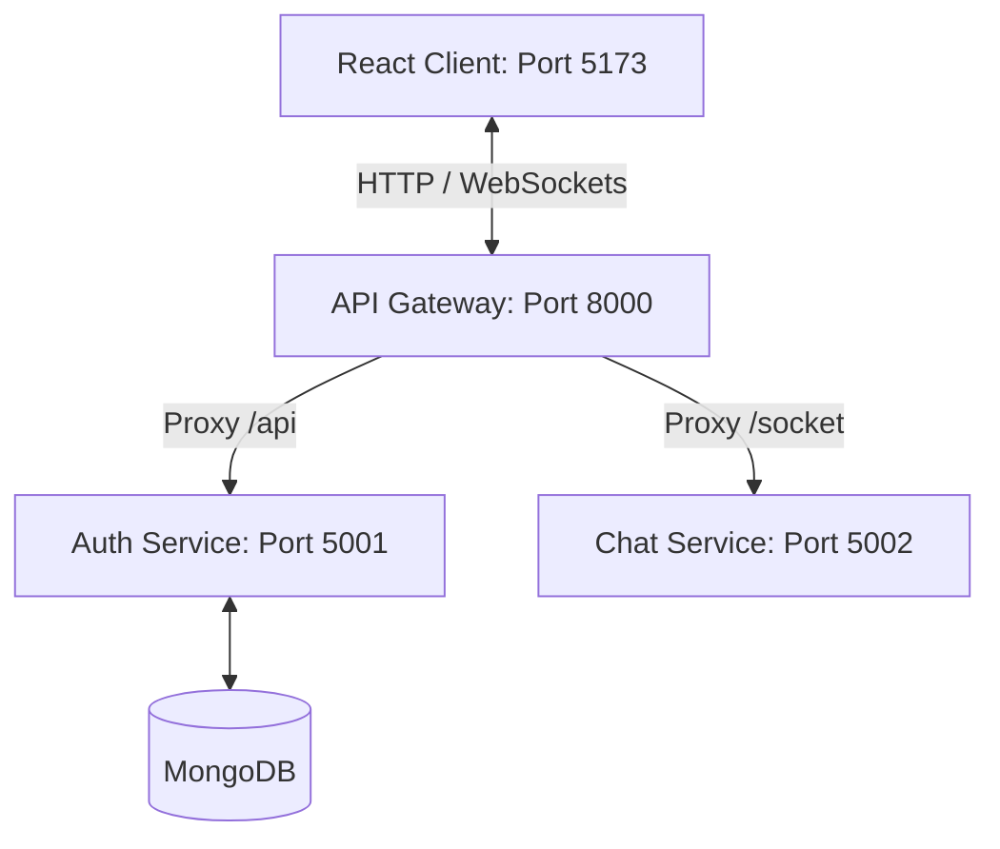

# 💬 Microservices Chat System with API Gateway

A modern, high-performance, and scalable real-time chat application built using a **Microservices Architecture**, powered by **React (Vite)**, **Tailwind CSS v4**, **Node.js**, **Express**, **Socket.io**, and **MongoDB**.

---

## 🏗️ System Architecture

The application is structured as a collection of decoupled services orchestrated through a central **API Gateway** to simplify routing, handle CORS, and secure internal communication.



---

## 📁 Repository Structure

```
chat-system/
├── client/                     # React Frontend (Vite)
│   ├── src/
│   │   ├── page/               # Chat, Login, and Signup pages
│   │   ├── App.jsx             # React Router & page mapping
│   │   └── main.jsx            # Entry point
│   ├── vite.config.js
│   └── package.json
└── backend/
    ├── package.json            # Monorepo controller script (Concurrently)
    ├── getway/                 # API Gateway Service (Port 8000)
    │   ├── server.js           # Handles routing proxies & CORS
    │   └── package.json
    ├── authService/            # Authentication Service (Port 5001)
    │   ├── config/             # MongoDB connection setup
    │   ├── models/             # Mongoose User schemas
    │   ├── routes/             # Signup & Login routes
    │   ├── server.js
    │   └── package.json
    └── chatService/            # Real-time Chat Service (Port 5002)
        ├── app.js              # Socket.io server connection handling
        └── package.json
```

---

## 🛠️ Tech Stack

* **Frontend**: React 19, Vite 8, Tailwind CSS v4, Lucide Icons, Socket.io-client
* **API Gateway**: Express, Http Proxy Middleware (v4.x)
* **Authentication**: Node.js, Express, MongoDB (Mongoose), JWT, bcrypt
* **Real-time Engine**: Node.js, Socket.io (v4.x)

---

## ⚡ Setup & Installation

### Prerequisites
Make sure you have [Node.js](https://nodejs.org/) (v16+) and [MongoDB](https://www.mongodb.com/) installed and running on your machine.

### 1. Clone & Install Dependencies
Install client and backend dependencies:

```bash
# Clone the repository
git clone <your-repo-url>
cd "chat system"

# Install main backend controller dependencies
cd backend
npm install

# Install service-specific dependencies
cd getway && npm install
cd ../authService && npm install
cd ../chatService && npm install

# Install client dependencies
cd ../../client
npm install
```

### 2. Configure Environment Variables
Create `.env` files for the microservices:

#### **Auth Service** (`backend/authService/.env`):
```env
PORT=5001
MONGO_URI=mongodb://localhost:27001/chatsystem  # Your MongoDB URI
JWT_SECRET=your_jwt_secret_key
```

#### **Chat Service** (`backend/chatService/.env`):
```env
PORT=5002
```

---

## 🚀 Running the Application

For developer convenience, you can spin up **all backend services and the frontend** using a single command run from the `backend` directory.

### Start Backend Services & Client
Navigate to the `backend` directory and run:
```bash
cd backend
npm run dev
```

This uses `concurrently` to spin up:
1. **API Gateway** on [http://localhost:8000](http://localhost:8000)
2. **Auth Service** on [http://localhost:5001](http://localhost:5001)
3. **Chat Service** on [http://localhost:5002](http://localhost:5002)
4. **React Client** on [http://localhost:5173](http://localhost:5173)

---

## 🔌 Socket.io Gateway Routing details

The socket connection routes dynamically through the central API Gateway to avoid CORS restrictions:

* **Client Handshake**: Initializes connection to `http://localhost:8000` with custom path `/socket/socket.io`.
* **Gateway Proxy**: Intercepts requests starting with `/socket` and forwards them to the real-time chat service running on `http://localhost:5002`.
* **Chat Service Handler**: Configured on `/socket/socket.io` to receive and process real-time communication events seamlessly.

---

## 📝 License
This project is licensed under the ISC License.
